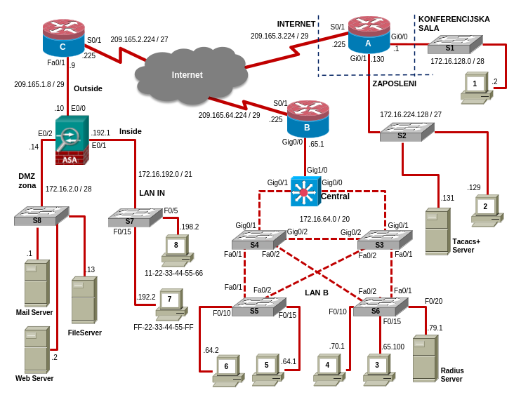

# Enterprise Network with Cisco ASA, IPsec VPN & AAA Security

A secure enterprise network designed and simulated in **Cisco Packet Tracer**,
spanning the access, distribution and perimeter layers. The project brings
together dynamic routing, Layer 2 hardening, access control, a site-to-site
IPsec VPN, an ASA edge firewall and centralized AAA authentication.

## Network Topology



**Full implementation write-up:** [docs/IMPLEMENTATION.md](docs/IMPLEMENTATION.md)
· **Verification & testing guide:** [docs/verification_guide.md](docs/verification_guide.md)

---

## Core Features & Technologies

### 1. Dynamic Routing with EIGRP
* EIGRP enabled across all routers with **`no auto-summary`**, so discontiguous
  subnets are advertised with correct masks (VLSM support).

### 2. Switching & VLAN Infrastructure
* Inter-switch links configured as **802.1Q trunks**; native VLAN moved off the
  default to **VLAN 90** on the S3–S4 trunks.
* Host ports set to **access** mode, switch links to **trunk** mode.
* Unused ports administratively shut down and parked in a **black-hole VLAN
  (VLAN 666)**.

### 3. Spanning Tree & Layer 2 Resilience
* **Central** set as primary and **S4** as secondary root bridge for VLAN 1.
* **PortFast + BPDU Guard** on host/server-facing edge ports (S5, S6).
* **Broadcast storm control** at a 50% threshold on the Central–S3–S4
  interconnects.

### 4. Port Security
* **Dynamic (sticky)** on S6 Fa0/10 - learns up to 3 MACs, `shutdown` on
  violation.
* **Static** on S7 - Fa0/5 pinned to PC8, Fa0/15 pinned to PC7, `shutdown` on
  violation.

### 5. DHCP Security
* **DHCP snooping** enabled globally on S5, scoped to VLAN 1.
* Host ports **rate-limited** to 4 DHCP requests/sec; switch and server uplinks
  marked as **trusted**.

### 6. Access Control Lists
* **Standard named (`SSH_MIKAN`):** permits SSH to Router B only from
  odd-numbered hosts of the LAN's lower range, and only Fridays 08:00–18:00 via
  a time range; the last usable host is denied at all times.
* **Extended named (`MIKAN`):** anti-spoofing filter blocking SSH to Router A
  and ICMP to the CONFERENCE-ROOM and EMPLOYEE LANs from bogon sources
  (RFC 1918 A/B/C, multicast, 127.0.0.0/8), with host PC6 whitelisted; inbound
  EIGRP updates to those LANs are dropped.

### 7. Site-to-Site IPsec VPN
* Encrypted tunnel on **Router B** protecting traffic between LAN B and the
  EMPLOYEE LAN, scoped by a crypto ACL.
* **IKE Phase 1:** AES-256, SHA-1, pre-shared key, DH group 5, 36000 s lifetime.
* **IKE Phase 2:** transform set `VPN-SET` (`esp-aes` + `esp-sha-hmac`) bound via
  crypto map `VPN-MAP`.

### 8. Perimeter Firewall, Cisco ASA (`MIKAN-ASA`)
* Three security-level interfaces: **inside (100)**, **outside (0)**,
  **DMZ (70)**; DMZ-to-inside traffic blocked.
* **PAT** for the inside network (`inside-net` object) and **static NAT** for
  the DMZ web server (`web-net` object).
* **DHCP server** on the inside interface: 32-address pool excluding the first
  10 addresses, DNS `209.165.210.20`, 10,000 s lease, domain `ict.com`.
* Management via **Telnet** (inside, 10-min timeout) and **SSH** (inside + host
  PC6, 15-min timeout, 1024-bit RSA), authenticated against the ASA's local AAA
  database.

### 9. Centralized AAA and TACACS+
* **Router B** authenticates administrators against a **TACACS+** server, with a
  **fallback** to the local database user (`mikan2`) if the server is
  unreachable.

### 10. Zone-Based Firewall on Router A
* Three security zones: **EMPLOYEE** (PC2 + TACACS+ server),
  **CONFERENCE-ROOM** (PC1) and **INTERNET** with interfaces assigned
  accordingly.

### 11. Device Hardening & Secure Management
* **S1** locked to **SSH-only** (Telnet disabled), 1024-bit RSA keys, SSHv2,
  70-second idle timeout, capped login attempts, privilege-15 access.
* MD5-hashed privilege-15 local accounts on Router A (`mixiuser`).
* **Role-based CLI view (`Tech_MIXI`)** exposing only `show protocols`,
  `show ip protocols` and `show ip route` for read-only field access.

---

## Repository Structure

```text
.
├── README.md                 # this file
├── docs/
│   ├── IMPLEMENTATION.md      # detailed, area-by-area write-up
│   ├── topology.png         # network diagram
├── configs/                  # exported running-config per device (.txt)
│   ├── RouterA.txt   RouterB.txt  RouterC.txt
│   ├── Central.txt   S1.txt … S7.txt
│   └── MIKAN-ASA.txt
└── packet-tracer/
    └── lab.pkt           # full Packet Tracer simulation
```

---

## How to Run the Lab

1. **Prerequisites:** Cisco Packet Tracer 8.2 or newer.
2. **Clone the repository:**
   ```
   git clone https://github.com/aleksasavic312/enterprise-network-security-lab.git
   ```
3. **Open the simulation:** launch `packet-tracer/lab.pkt`.
4. **Or just read the configs:** every device's running-config is in `configs/`
   as plain text, no Packet Tracer required to review the work.

### Verifying it works
A full, area-by-area checklist of `show`/`ping` commands and expected results is
in **[docs/verification_guide.md](docs/verification_guide.md)**. Quick checks:
* Inside hosts receive addresses automatically via **DHCP from the ASA**.
* `show ip route` / `show ip eigrp neighbors` confirm EIGRP adjacencies.
* `show crypto isakmp sa` and `show crypto ipsec sa` confirm the VPN tunnel.
* `show port-security` confirms the S6/S7 restrictions.

---


## Accounts & Credentials (lab)

> These are **simulation credentials** defined by the assignment, kept here
> only so the lab is reproducible. They are **not real secrets** and protect
> nothing outside this Packet Tracer file.

| Device / Purpose | Username | Password / Key | Notes |
|---|---|---|---|
| Router A - enter privileged exec mode | / | `cisco` | / |
| Router A - local admin | `mixiuser` | `mixiuser12345` | privilege 15, MD5 |
| Router A - technician role | role `Tech_MIXI` | `techpass` | read-only `show` commands, MD5 |
| S1 — SSH admin | `adminmikana` | `mikana12345` | privilege 15, MD5, domain `mixi.com` |
| Router B / local fallback | `mikan2` | `mikan2pa55` | used if TACACS+ is unreachable |
| Router B / TACACS+ shared key | — | `mikica123` | router ↔ TACACS+ server |
| Site-to-Site VPN — pre-shared key | — | `vpnpa55` | ISAKMP Phase 1 |
| ASA — local admin | `mixiadmin` | `mixi123` | AAA local; SSH domain `sshbezbednost.com` |

To enter privileged EXEC mode on the MIKAN-ASA device, simply press Enter when prompted for a password, as the default password is blank.

---
